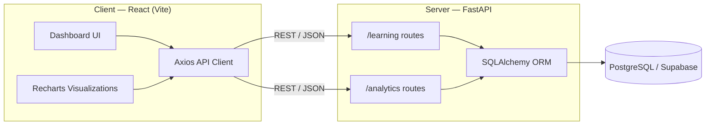

# 📊 Learning Analytics

Track what you learn, when you learn it, and how consistent you really are.
A full-stack dashboard that turns raw study logs into actionable insights.

---

## 📖 About the Project

Learning Analytics is a personal learning-tracker and analytics dashboard built to help you understand your own study habits over time. Instead of just logging what topics you studied, the app computes derived metrics — streaks, consistency scores, monthly goal progress, and topic-wise time distribution — so you can see patterns in your learning behavior rather than just a raw list of entries.

The project is split into two independently deployable services: a **React SPA** for the UI and a **FastAPI** service that owns all business logic and persistence. This separation keeps the frontend simple (pure presentation and state) and the backend testable and framework-agnostic.

---

## ✨ Features

- **Learning Entry Management** — Create, edit, and delete study log entries (topic, date, hours).
- **Overview Dashboard** — At-a-glance cards for total hours studied and total sessions logged.
- **Study Time Chart** — Visualize study hours over time in daily or aggregated views.
- **Topic Breakdown** — See which topics consume the most study time.
- **Skills Developed** — Aggregated view of distinct skills/topics covered.
- **Streak Tracking** — Current consecutive-day streak and your all-time best streak.
- **Consistency Score** — A normalized score reflecting how evenly you've studied across the month.
- **Monthly Goal Tracking** — Set an hours-based monthly goal and track completion in real time.
- **Smart Insights** — Auto-generated observations based on recent activity trends.

---

## 🛠 Tech Stack

**Frontend**
- React (Vite)
- Tailwind CSS
- Axios
- Recharts (data visualization)
- Framer Motion (animations)
- React Icons
- React Toastify (notifications)

**Backend**
- FastAPI
- SQLAlchemy (ORM)
- Pydantic (schema validation)
- Uvicorn (ASGI server)

**Database**
- PostgreSQL (Supabase-hosted, pooled connection)
- SQLite (automatic local-development fallback)

**Deployment**
- Vercel 

---

## 🚀 Local Setup

### Prerequisites
- Node.js & npm
- Python 3.10+

### 1. Clone the Repository
```bash
git clone https://github.com/hema-code06/Learning_Analytics.git
cd Learning_Analytics
```

### 2. Backend Setup
```bash
cd server
pip install -r requirements.txt
cp .env.example .env   # optional locally — see note below
uvicorn main:app --reload
# Runs at http://localhost:8000
```
> `DATABASE_URL` is optional for local development. If it isn't set, the API automatically falls back to a local SQLite file (`server/learning.db`), so the project runs with zero configuration. Set `DATABASE_URL` in `.env` to point at a real PostgreSQL instance instead.

### 3. Frontend Setup
```bash
cd client
npm install
cp .env.example .env   # set VITE_API_URL if your API isn't on localhost:8000
npm run dev
# Runs at http://localhost:5173
```

---

## 🏗 Architecture



The frontend never talks to the database directly — every read and write goes through the FastAPI service, which validates input via Pydantic schemas, executes queries through SQLAlchemy, and returns typed JSON responses. This keeps a single source of truth for business rules (e.g. streak and consistency calculations) on the server rather than duplicating logic on the client.

---

## 🔭 Future Improvements

- Add user authentication so the dashboard supports multiple accounts.
- Persist and expose historical monthly-goal records (not just the current month).
- Introduce caching (e.g. Redis) for analytics endpoints that aggregate large datasets.
- Add export functionality (CSV/PDF) for study logs and analytics summaries.
- Support tagging entries with difficulty or confidence level for richer insights.

---

*Built With ❤️ using React · FastAPI · SQLAlchemy · PostgreSQL · Supabase · Tailwind CSS*

